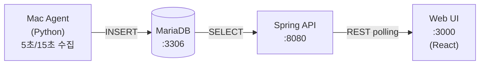

# architecture.md — 시스템 아키텍처
> **버전**: v0.1.0 | **최종 업데이트**: 2026-03-04

---

## Phase별 아키텍처 진화

```mermaid
flowchart TD
    subgraph Phase0["Phase 0 — MVP"]
        A0[Mac Agent\nPython + psutil\nCore 6종] --> B0[MariaDB\n메트릭 직접 적재]
        B0 --> C0[Spring API v0]
        C0 --> D0[Web UI\npolling + 그래프]
    end

    subgraph Phase1["Phase 1 — 실시간 + 이력"]
        A1[Mac Agent] --> B1[MariaDB]
        B1 --> C1[Spring API\nSSE / WebSocket]
        C1 --> D1[Web UI\n실시간 갱신 + 기간필터 + 알람]
    end

    subgraph Phase2["Phase 2 — Druid 도입"]
        A2[Mac Agent] --> DR[Apache Druid\n시계열 적재/롤업]
        A2 --> B2[MariaDB\n메타/알람]
        DR --> C2[Spring API]
        B2 --> C2
        C2 --> D2[Web UI]
    end

    subgraph Phase3["Phase 3 — Kafka + Airflow"]
        A3[Mac Agent] --> KF[Kafka\nTopic: metrics.*]
        KF --> DR3[Druid\nKafka Ingestion]
        KF --> AF[Airflow\n배치/집계/리포트]
        AF --> B3[MariaDB\n요약 테이블]
        DR3 --> C3[Spring API]
        B3 --> C3
        C3 --> D3[Web UI]
    end

    subgraph Phase4["Phase 4 — LLM 연동"]
        D4[Web UI\nLLM Chat UI] --> LLM[LLM API\nClaude / GPT]
        LLM --> C4[Spring API]
        C4 --> DR4[Druid]
        C4 --> B4[MariaDB]
    end
```



---

## 컴포넌트 역할 정의

| 컴포넌트 | 기술 | 역할 |
|---|---|---|
| **Mac Agent** | Python + psutil | Core 메트릭 수집 → Kafka 또는 MariaDB |
| **Kafka** | Apache Kafka (Docker) | 실시간 메트릭 스트리밍 허브 (Phase 3+) |
| **Apache Druid** | Druid (Docker) | 시계열 원본 적재 / 롤업 / 대시보드 질의 |
| **MariaDB** | MariaDB (Docker) | 장비/알람 메타 + Phase 0~1 메트릭 |
| **Airflow** | Apache Airflow (Docker) | 시간/일 단위 배치 집계, 리포트, 아카이빙 |
| **Spring API** | Spring Boot (Java) | REST API + SSE/WS, Druid·MariaDB 조회 |
| **Web UI** | React | 실시간 대시보드 + 이력 조회 + 알람 + LLM Chat |
| **LLM** | Claude / GPT API | 자연어 요약·조회, (최종) UI 컨트롤 |

---

## Phase 0 상세 — 최소 인프라



**docker-compose 구성 대상 (Phase 0)**
- `mariadb:11` — port 3306
- `spring-api` — port 8080 (로컬 빌드 또는 JAR)
- `react-ui` — port 3000 (개발 서버 또는 nginx)

---

## 데이터 흐름 요약

```
수집(Agent) → 전송(Kafka/직접) → 저장(Druid/MariaDB) → 조회(Spring API) → 표시(UI/LLM)
```

| 흐름 | Phase |
|---|---|
| Agent → MariaDB (직접) | 0~1 |
| Agent → Druid (HTTP push) | 2 |
| Agent → Kafka → Druid | 3 |
| Airflow → MariaDB (배치 집계) | 3 |
| UI → LLM API → Spring API → DB | 4 |
